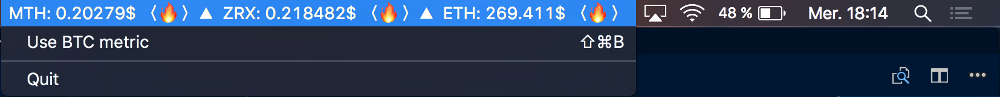

# Cryptobar

## What's that
Cryptobar is a macOS status bar app that track your favorite cryptocurrencies 🚀.

It looks like the following:


You can track all your favorite cryptocurrences in **real time** within the blink of an eye to keep your producitivity.

## Installation

```
$ g clone git@github.com:commit-master/cryptobar.git
$ cd cryptobar
$ python3 setup.py py2app -A
```

**NOTE:** you will need `py2app` to build the app in standalone mode. You can find the instructions here https://py2app.readthedocs.io/en/latest/install.html#installing-with-pip. Also, you will need the packages listed in the requirements.txt file.

```
$ pip3 install -r requirements.txt
```

You can use pip to install them directly.

Once everything is installed and you have built the project, a `dist` folder has been created and contain the basic app (the same as the one provided within the repository).

In order to track other cryptocurrencies, open `main.py` with your favorite editor and edit the following:

```python
(l.12) CURRENCIES = ['monetha', 'ethereum', 'bitcoin']
```

Change this list with any cryptocurrency you want that is listed on https://coinmarketcap.com/assets/.

Then you will need to build the app again:
```
$ python3 setup.py py2app -A
```

## Quit
In order to quit the application, simply click on the status bar and a `Quit` option will show:


## Other
This README is a work in progress.

If you have any questions, or want to contribute to this repository, open up an issue, I'd be glad to answer it.